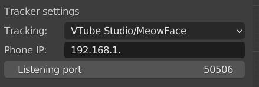

Add-on configuraion manual
==========================

In order to get a model to track properly, a few conditions on the model needs to be present. In this document we will go through these and how to set it up.

The word blendshape and shape key is used interchangebly in this document.

Model properties
================

This first section will go through how to select the correct parts of your model in the "Model properties" section. Every field in this section needs to be filled before allowing the model to be tracked. These settings will take effect when you start the tracking. If you change it during tracking it will not take effect until you stop and start again.

Armature
--------

The armature should point to the armature that belongs to the model that you want to track. The bones of this armature will be the ones available to select in the later fields.

Bones
-----

Once the armature has been selected, the bone fields will be pre-populated with the most common names for the respective bone. The common naming for the bones required by this add-on is \[Head, Chest, Hips, LeftEye, RightEye\]. All bones are used when OpenSeeFace tracking is selected. If another tracking method is selected, \[LeftEye, RightEye\] will not be used. However they still need to be selected in order for the add-on to allow you to start tracking.

If the model is not moving as expected there might be some bone that is not in its proper place or the wrong bone is selected.

### Eye bone position

If you use OpenSeeFace as your tracking data producer, the eye bones need to be in a specific position for them to rotate correctly. The bone head should be placed at the center of the eye ball and the tail should point straight up. See the images for example.

Facemesh
--------

The facemesh property is used for all blendshapes. The mesh should contain vowel and blinking blendshapes if OpenSeeFace is used, or ARKit blendshapes if VTube Studio tracking is used. For ARKit blendshapes the naming should follow the standard. [https://arkit-face-blendshapes.com/](https://arkit-face-blendshapes.com/)

OpenSeeFace blendshape list. One of each should exist. Any of the names on the same line can be used for the blendshape.

*   A, a, あ
*   I, i, い
*   U, u, う
*   E, e, え
*   O, o, お
*   blink\_left, ウィンク
*   blink\_right, ウインク右

If your model is not doing a certain movement, for example not blinking, the name of the blendshape may be wrong. It must match for it to work.

Regarding performance, it is not recommended to have your entire model as one single mesh. While it is possible to make that work it may use a lot of resources to apply blendshapes to a large mesh. It is recommended to separate the head/face from body, clothes and hair to increase performance.

Tracker settings
================

The tracker settings will allow you to specify which kind of tracking you want to use. The alternatives are OpenSeeFace, VTube Studio(iPhone) or MeowFace(Android). MeowFace uses the same specification as VTube Studio so either can be used.

OpenSeeFace
-----------

When using OpenSeeFace, a listening port needs to be specified. The default value will be sufficient in most cases unless you change it on your OpenSeeFace data producer.

VTube Studio or MeowFace
------------------------

VTube Studio or MeowFace needs to have an IP entered that points to the device that will produce the tracking data. Your phone should be connected to the same network as the computer that is running this add-on. Enter the IP address of your phone into the "Phone IP" field. For VTube Studio you need to enable 3rd party application support at the bottom of the settings page for it to work. Listening port can be set to anything but the default value is good. Only change this if you have conflicting ports.

Tweaks
======

Following is the list of settings that can change the behavour of the model during tracking. Some settings will be applied instantly but some needs the tracking to restart in order to take effect.

Framerate
---------

The framerate is the amount of times per second that the mode will update. The higher this value is the more smooth the tracking will be but it will also use more resources. In order for this value to take effect the tracking needs to be restarted.

Smoothing
---------

The add-on uses floating average to apply smoothing. It is only applied to bone movement and not blendshapes. You can increase this value if the model is shaking during during tracking. However a too high value will make it look like the model is slow at reacting to movement. This value only takes effect after the tracking is restarted.

Head to body movement ratio
---------------------------

This value is a ratio between 0.0 and 1.0 (0% - 100%). It will determine how much the head will move in relation to the body.
