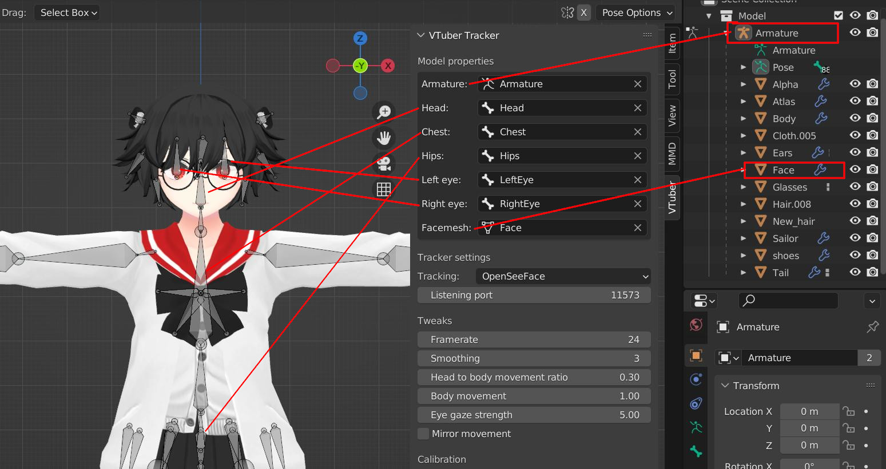
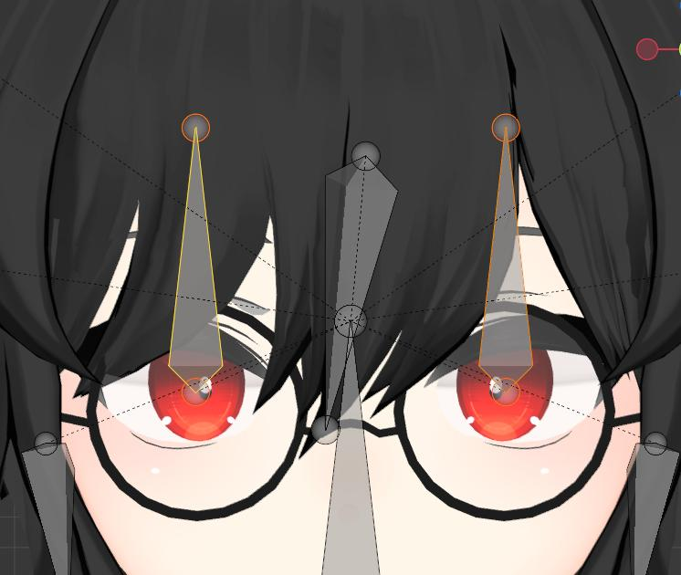
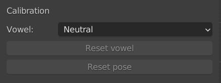

# お知らせ
日本語の説明書はすぐに作っています。これはただのグーグル翻訳です！ご不自由をおかけして申し訳ございません。

# アドオン設定マニュアル

モデルを適切に追跡するには、モデルにいくつかの条件が存在する必要があります。このドキュメントでは、これらとその設定方法について説明します。

このドキュメントでは、blendshape と shape key という言葉を同じ意味で使用しています。

# モデルのプロパティ

この最初のセクションでは、「モデル プロパティ」セクションでモデルの正しいパーツを選択する方法について説明します。モデルの追跡を許可する前に、このセクションのすべてのフィールドに入力する必要があります。これらの設定は、トラッキングを開始すると有効になります。追跡中に変更した場合、停止して再度開始するまで有効になりません。

## アーマチュア

アーマチュアは、追跡するモデルに属するアーマチュアを指す必要があります。このアーマチュアのボーンは、後のフィールドで選択できるものになります。

## 骨格

アーマチュアが選択されると、それぞれのボーンの最も一般的な名前がボーン フィールドに事前入力されます。このアドオンに必要なボーンの一般的な名前は [頭、胸、腰、左目、右目] です。 OpenSeeFace トラッキングが選択されている場合、すべてのボーンが使用されます。別の追跡の場合
[LeftEye, RightEye]は使用しません。ただし、アドオンで追跡を開始できるようにするには、それらを選択する必要があります.

モデルが期待どおりに動かない場合は、ボーンが適切な場所にないか、間違ったボーンが選択されている可能性があります。

### 目の骨の位置

トラッキング データ プロデューサーとして OpenSeeFace を使用する場合、目の骨が正しく回転するには、目の骨が特定の位置にある必要があります。骨の頭を眼球の中心に置き、尾をまっすぐ上に向けます。
たとえば、画像を参照してください。

## フェイスメッシュ

facemesh プロパティはすべてのブレンドシェイプに使用されます。メッシュには、OpenSeeFace が使用されている場合は母音と点滅のブレンドシェイプが含まれている必要があり、VTube Studio トラッキングが使用されている場合は ARKit のブレンドシェイプが含まれている必要があります。 ARKit ブレンドシェイプの場合、命名は標準に従う必要があります。 <https://arkit-face-blendshapes.com/>

OpenSeeFace ブレンドシェイプ リスト。それぞれ 1 つずつ存在する必要があります。同じ行にある任意の名前をブレンドシェイプに使用できます。

  * A, a, あ
  * I, i, 私
  * U, i, う
  * E, e, え
  * O, o, お
  * blink_left, ウィンク
  * blink_right, ウインク右

モデルが特定の動きをしていない場合 (まばたきをしていないなど)、blendshape の名前が間違っている可能性があります。それが機能するには、一致する必要があります。

パフォーマンスに関しては、モデル全体を 1 つのメッシュにすることはお勧めしません。それを機能させることは可能ですが、ブレンドシェイプを大きなメッシュに適用するために多くのリソースを使用する可能性があります。パフォーマンスを向上させるために、頭/顔を体、衣服、髪から分離することをお勧めします。

# トラッカー設定

トラッカー設定では、使用するトラッキングの種類を指定できます。代替手段は、OpenSeeFace、VTube Studio(iPhone)、または MeowFace(Android) です。 MeowFaceはVTube Studioと同じ仕様なのでどちらでも使えます。

## OpenSeeFace

OpenSeeFace を使用する場合、リスニング ポートを指定する必要があります。 OpenSeeFace データ プロデューサーで変更しない限り、ほとんどの場合、デフォルト値で十分です。

## VTube Studio または MeowFace

VTube Studio または MeowFace には、追跡データを生成するデバイスを指す IP を入力する必要があります。電話は、このアドオンを実行しているコンピューターと同じネットワークに接続する必要があります。 「電話 IP」フィールドに電話の IP アドレスを入力します。 VTube Studio を動作させるには、設定ページの下部でサードパーティ アプリケーションのサポートを有効にする必要があります。リスニング ポートは任意に設定できますが、デフォルト値は適切です。
競合するポートがある場合にのみ、これを変更してください。

# 微調整

以下は、追跡中のモデルの動作を変更できる設定のリストです。一部の設定はすぐに適用されますが、有効にするために追跡を再開する必要があるものもあります。

## フレームレート

フレームレートは、モードが更新される 1 秒あたりの回数です。この値が高いほど追跡はスムーズになりますが、より多くのリソースを使用します。この値を有効にするには、追跡を再開する必要があります。

## スムージング

アドオンは、平滑化を適用するために浮動平均を使用します。ボーンの動きにのみ適用され、ブレンドシェイプには適用されません。追跡中にモデルが揺れている場合は、この値を増やすことができます。ただし、値が高すぎると、モデルが動きに反応するのが遅いように見えます。この値は、追跡が再開された後にのみ有効になります。

## 頭と体の動きの比率

この値は、0.0 と 1.0 (0% - 100%) の間の比率です。体に対して頭がどれだけ動くかを決定します。 0.0 に設定すると、頭だけが動きます。 1.0 に設定すると、ボディのみが移動します。この値はいつでも変更でき、直接有効になります。
## 体の動き

体の動きは、モデル全体が動く量を増幅します。 Hips ボーンに影響を与えるため、モデル全体が移動します。値が高いほどモデルはより活発に見え、値が低いほどモデルはより静止したものになります。この値はいつでも変更でき、直接有効になります。

## 視線の強さ

この値は、OpenSeeFace トラッキングが使用されている場合にのみ使用されます。この設定で高い値を設定すると、目の動きが増幅されます。自然に見えるようにするには、モデルが異なれば、異なる値が必要になります。この値はいつでも変更でき、直接有効になります。

## 鏡の動き

この設定を有効にすると、モデルの動きが反映されます。この設定はまだ実験段階です。ミラーリングされた方法でモデルをキャプチャする場合は、代わりにウィンドウ キャプチャを反転することをお勧めします。

# キャリブレーション

VTube Studio はほとんどのキャリブレーションをデータ プロデューサー側で行うため、キャリブレーションする必要はありません。アドオンはいくつかのデータ パラメータに基づいて独自に母音を計算するため、キャリブレーションが必要なのは OpenSeeFace だけです。リセット ポーズは、キャラクターを画面の中央に再配置するためにいつでも使用できます。

## 母音をリセット

この設定は、OpenSeeFace でのみ使用されます。トラッキングを調整するには、トラッキングを開始する必要があります。母音を調整するときは、最初にドロップダウン メニューで調整する母音を選択します。次に、母音である顔を作成し、「母音のリセット」ボタンを押します。たとえば、A 母音を調整する場合。ドロップダウンで A を選択し、A を大きな声で言って、[母音のリセット] ボタンを押します。現在の口の形を記録し、A 母音として保存します。これは、後で話すときに口の形を計算するために使用されます。

「ニュートラル」母音は黙っているときです。口を閉じて中立の顔でこれを調整します。

## ポーズをリセット

このボタンは、モデルを初期位置に再センタリングします。モデルがおかしな角度に動かされたり、遠くに浮いてしまったりした場合、これはモデルを中心に戻します。
